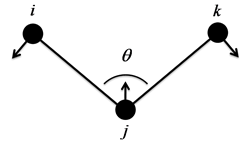

Angle bending
-------------
**Overview**

Angles impose forces on specific triplets of particles to model chemical angles between two bonds.
The angles are specified in configuration file with the format::

   <angle>
   angle_type(str)  particle_i(int)  particle_j(int)  particle_k(int)
   ...
   </angle>
   
By themselves, angles do nothing. Only when you specify an angle force in script(i.e. :py:class:`AngleForceHarmonic`), are forces actually calculated between the listed particles.

============================   =================================
:ref:`harmonic-angle`          :py:class:`AngleForceHarmonic`
:ref:`harmonic-cosine-angle`   :py:class:`AngleForceHarmonicCos`
:ref:`cosine-angle`            :py:class:`AngleForceCos`
============================   =================================

.. _harmonic-angle:	
	
Harmonic angle potential
^^^^^^^^^^^^^^^^^^^^^^^^

Description:

    .. math::
        :nowrap:

        \begin{eqnarray*}
        V_{\mathrm{angle}}(\theta) = \frac{1}{2}k\left( \theta -\theta_{0} \right)^{2}
        \end{eqnarray*}

    Coefficients:

    - :math:`k` - potential constant ``k`` (in units of energy/radians^2)
    - :math:`\theta_{0}` - equilibrium angle ``theta0`` (in degrees)

.. py:class:: AngleForceHarmonic(all_info)

   The constructor of angle harmonic interaction object.
 
   :param AllInfo all_info: The system information.

   .. py:function:: setParams(string type, float k, float theta0)
   
      specifies the angle harmonic force parameters with angle type, potential constant, and equilibrium angle degree.
	  
   Example::
   
      angleforce = galamost.AngleForceHarmonic(all_info)
      angleforce.setParams('P-G-G', 25.000, 120.000)
      app.add(angleforce)

.. _harmonic-cosine-angle:
	  
Harmonic cosine angle potential
^^^^^^^^^^^^^^^^^^^^^^^^^^^^^^^

Description:

    .. math::
        :nowrap:

        \begin{eqnarray*}
        V_{\mathrm{angle}}(\theta)=\frac{1}{2}k\left[\cos \left( \theta \right)-\cos \left( \theta_{0} \right)\right]^{2}	
        \end{eqnarray*}

    Coefficients:

    - :math:`k` - potential constant ``k`` (in units of energy)
    - :math:`\theta_{0}` - equilibrium angle ``theta0`` (in degrees)

.. py:class:: AngleForceHarmonicCos(all_info)

   The constructor of angle cosine harmonic interaction object.
 
   :param AllInfo all_info: The system information.

   .. py:function:: setParams(string type, float k, float theta0)
   
      specifies the angle cosine harmonic force parameters with angle type, potential constant, and equilibrium angle degree.
	  
   Example::
   
      angleforce = galamost.AngleForceHarmonicCos(all_info)
      angleforce.setParams('P-G-G',25.000, 120.000)
      app.add(angleforce)

.. _cosine-angle:
	  
Cosine angle potential
^^^^^^^^^^^^^^^^^^^^^^^^^^^^^^^

Description:

    .. math::
        :nowrap:

        \begin{eqnarray*}
        V_{\mathrm{angle}}(\theta)=k\left[ 1-\cos \left( \theta - {\theta}_{0} \right) \right]		
        \end{eqnarray*}

    Coefficients:

    - :math:`k` - potential constant ``k`` (in units of energy)
    - :math:`\theta_{0}` - equilibrium angle ``theta0`` (in degrees)

.. py:class:: AngleForceCos(all_info)

   The constructor of angle cosine interaction object.
 
   :param AllInfo all_info: The system information.

   .. py:function:: setParams(string type, float k, float theta0)
   
      specifies the angle cosine force parameters with angle type, spring constant, and equilibrium angle degree.
	  
   Example::
   
      angleforce = galamost.AngleForceCos(all_info)
      angleforce.setParams('P-G-G', 25.000, 120.000)
      app.add(angleforce)
  
	  