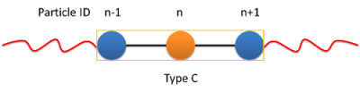

Short range non-bonded interactions
===================================
   
**Overview**

The net non-bonded force of each particle is produced by summing all the non-bonded forces of neighboring particles on the basis of a neighbor list that lists
the interacting particles for each particle, built beforehand. Because of the independence of parallel CUDA threads, a pair of interacting particles is inevitably 
included independently in neighbor list in the mode that one thread calculates and sums all non-bonded forces of a particle. The common non-bonded potential energy 
functions are included in GALAMOST.

==========================   =====================
:ref:`lennard-jones`         :py:class:`LjForce`
:ref:`shift-lennard-jones`   :py:class:`SljForce`
:ref:`harmonic-repulsion`    :py:class:`PairForce`
:ref:`gaussian-repulsion`    :py:class:`PairForce`
:ref:`IPL-potential`         :py:class:`PairForce`
==========================   =====================

.. _lennard-jones:

Lennard-Jones (LJ) interaction
------------------------------

Description:

    .. math::
        :nowrap:

        \begin{eqnarray*}
        V_{\mathrm{LJ}}(r)  = & 4 \epsilon \left[ \left( \frac{\sigma}{r} \right)^{12} -
                          \alpha \left( \frac{\sigma}{r} \right)^{6} \right] & r < r_{\mathrm{cut}} \\
                            = & 0 & r \ge r_{\mathrm{cut}} \\
        \end{eqnarray*}

    The following coefficients must be set per unique pair of particle types:

    - :math:`\epsilon` - *epsilon* (in energy units)
    - :math:`\sigma` - *sigma* (in distance units)
    - :math:`\alpha` - *alpha* (unitless) - *optional*: defaults to 1.0
    - :math:`r_{\mathrm{cut}}` - *r_cut* (in distance units)
      - *optional*: defaults to the global r_cut specified in the pair command

.. py:class:: LjForce(all_info, nlist, r_cut)

   The constructor of LJ interaction calculation object.
	  
   :param AllInfo all_info: The system information.
   :param NeighborList nlist: The neighbor list.  
   :param float r_cut: The cut-off radius.

   .. py:function:: setParams(string type1, string type2, float epsilon, float sigma, float alpha)
 
      specifies the LJ interaction parameters with type1, type2, epsilon, sigma, and alpha.

   .. py:function:: setParams(string type1, string type2, float epsilon, float sigma, float alpha, float r_cut)
   
      specifies the LJ interaction parameters with type1, type2, epsilon, sigma, alpha, and cut-off of radius.
	  
   .. py:function:: setEnergy_shift()
   
      calls the function to shift LJ potential to be zero at cut-off point.
   
   Example::
   
      lj = galamost.LjForce(all_info, neighbor_list, 3.0)
      lj.setParams('A', 'A', 1.0, 1.0, 1.0)
      lj.setEnergy_shift()
      app.add(lj)	# Note: adds this object to the application.
	  
.. _shift-lennard-jones:
	  
Shift Lennard-Jones (LJ) interaction
------------------------------------

Description:

    .. math::
        :nowrap:

        \begin{eqnarray*}
           V_{\mathrm{SLJ}}(r)=&4 \epsilon \left[ \left( \frac{\sigma }{r-\Delta } \right)^{12}-\alpha \left( \frac{\sigma }{r-\Delta } \right)^{6} \right] 
		                       & r<(r_{\mathrm{cut}}+\Delta )  \\
                            = & 0 & r \ge (r_{\mathrm{cut}}+\Delta )  \\
        \end{eqnarray*}

    The following coefficients must be set per unique pair of particle types:

    - :math:`\epsilon` - *epsilon* (in energy units)
    - :math:`\sigma` - *sigma* (in distance units)
    - :math:`\alpha` - *alpha* (unitless) - *optional*: defaults to 1.0
    - :math:`\Delta = (d_{i} + d_{j})/2 - \sigma` - (in distance units); :math:`d_{i}` and :math:`d_{j}` are the diameter of particle :math:`i` and :math:`j` which can be input from XML file.
    - :math:`r_{\mathrm{cut}}` - *r_cut* (in distance units)
      - *optional*: defaults to the global r_cut specified in the pair command

	  
.. py:class:: SljForce(all_info, nlist, r_cut)

   The constructor of shift LJ interaction calculation object.
	  
   :param AllInfo all_info: The system information.
   :param NeighborList nlist: The neighbor list.  
   :param float r_cut: The cut-off radius.

   .. py:function:: setParams(string type1, string type2, float epsilon, float sigma, float alpha)
   
      specifies the shift LJ interaction parameters with type1, type2, epsilon, sigma, and alpha.
	  
   .. py:function:: setParams(string type1, string type2, float epsilon, float sigma, float alpha, float r_cut)
   
      specifies the shift LJ interaction parameters with type1, type 2, epsilon, sigma, alpha, and cut-off of radius.
	  
   .. py:function:: setEnergy_shift()
   
      calls the function to shift LJ potential to be zero at the cut-off point.
	  
   Example::
   
      slj = galamost.SljForce(all_info, neighbor_list, 3.0)
      slj.setParams('A', 'A', 1.0, 1.0, 1.0)
      slj.setEnergy_shift()
      app.add(slj)

	  
.. _linear-pi-pi:
	  
Linear molecule :math:`\pi`-:math:`\pi` interaction
---------------------------------------------------

Description:

    .. math::
        :nowrap:

        \begin{eqnarray*}
           V_{\mathrm{\pi-\pi}}(r, \theta)=&-\epsilon \cos^{2}\theta (1-r) 
		                       & r<r_{\mathrm{cut}}  \\
                            = & 0 & r \ge r_{\mathrm{cut}} \\
        \end{eqnarray*}

    - :math:`\theta` - (in radians)  the angle between two linear molecules
    - :math:`r_{\mathrm{cut}}` - *r_cut* (in distance units)
      - *optional*: defaults to the global r_cut	

    The following coefficients must be set per unique pair of particle types:

    - :math:`\epsilon` - *epsilon* (in energy units)

   The transitional forces are added between the center particles of linear molcules. A group of 
   the center particles are needed for :py:class:`CenterForce`. The rotational forces are added
   on the two neighbor particles of a center particle.
    

	 
.. py:class:: CenterForce(all_info, nlist, group, r_cut, epsilon)

   The constructor of a pi-pi interaction calculation object for linear molecules.
   
   :param AllInfo all_info: The system information.
   :param NeighborList nlist: The neighbor list. 
   :param ParticleSet group: The group of center particles.   
   :param float r_cut: The cut-off radius.
   :param float epsilon:  the depth of the potential well. 

   .. py:function:: setPreNextShift(int prev, int next)
   
      sets the previous particle and next particle of center particle with shift ID value, the default value is -1 and 1, respectively.

   Example::
   
      groupC = galamost.ParticleSet(all_info, 'C')
      cf = galamost.CenterForce(all_info,neighbor_list, groupC, 1.0, 2.0)
      app.add(cf)	  
	  
Pair interaction
----------------

.. _harmonic-repulsion:
   
Harmonic repulsion
^^^^^^^^^^^^^^^^^^
   
Description:
   
    .. math::
        :nowrap:
   	
        \begin{eqnarray*}
   	V_{\mathrm{harmonic}}(r)=&\frac{1}{2}\alpha \left(1-\frac{r}{r_{cut}} \right)^{2} & r < r_{\mathrm{cut}} \\				
                            = & 0 & r \ge r_{\mathrm{cut}} \\
        \end{eqnarray*}				
   
   
    The following coefficients must be set per unique pair of particle types:
   
    - :math:`\alpha` - *alpha* (in energy units)
    - :math:`r_{\mathrm{cut}}` - *r_cut* (in distance units)

   :ref:`pair-sc-label` 	

.. _gaussian-repulsion:
   
Gaussian repulsion
^^^^^^^^^^^^^^^^^^
   
Description:
   
    .. math::
        :nowrap:
   
        \begin{eqnarray*}
   	V_{\mathrm{Gaussion}}(r)=& \epsilon \exp \left[ -\frac{1}{2}{\left( \frac{r}{\sigma} \right)}^{2} \right] & r < r_{\mathrm{cut}} \\				
                            = & 0 & r \ge r_{\mathrm{cut}} \\
        \end{eqnarray*}				
   
   
    The following coefficients must be set per unique pair of particle types:
   
    - :math:`\epsilon` - *epsilon* (in energy units)
    - :math:`\sigma` - *sigma* (in distance units)
    - :math:`r_{\mathrm{cut}}` - *r_cut* (in distance units)
	
   :ref:`pair-sc-label` 
  
.. _IPL-potential:
  
IPL potential
^^^^^^^^^^^^^
   
Description:
   
    .. math::
        :nowrap:
   	
        \begin{eqnarray*}
   	V_{\mathrm{IPL}}(r)=&\epsilon \left(\frac{\sigma}{r} \right)^{n} & r < r_{\mathrm{cut}} \\				
                            = & 0 & r \ge r_{\mathrm{cut}} \\
        \end{eqnarray*}				
   
   
    The following coefficients must be set per unique pair of particle types:
   
    - :math:`\epsilon` - *epsilon* (in energy units)
    - :math:`\sigma` - *sigma* (in distance units)	
    - :math:`n` - *n* (unitless)	
    - :math:`r_{\mathrm{cut}}` - *r_cut* (in distance units)
	
   :ref:`pair-sc-label` 
	
.. _pair-sc-label:

Script commands
^^^^^^^^^^^^^^^

.. py:class:: PairForce(all_info, nlist)

   The constructor of pair interaction calculation object.
	  
   :param AllInfo all_info: The system information.
   :param NeighborList nlist: The neighbor list.  

   .. py:function:: setParams(string type1, string type2, float param0, float param1, float param2, float r_cut, Func function)
   
      specifies the interaction and its parameters with type1, type2, parameter0, parameter1, parameter2, cut-off radius, and potential type.
   
   .. py:function:: setShiftParams(string type1, string type2, float param0, float param1, float param2, float r_cut, float r_shift, Func function)
   
      specifies the interaction and its parameters with type1, type2, parameter0, parameter1, parameter2, cut-off radius, shift radius, and potential type. This method employs the shift function same as the one of GROMACS.
   
    
   ==============   ==========   ==========   ==========
   Function types   Parameter0   Parameter1   Parameter2
   ==============   ==========   ==========   ==========
   lj12_6           epsilon      sigma        alpha
   lj9_6            epsilon      sigma        alpha
   harmonic         alpha                               
   gauss            epsilon      sigma                  
   ipl              epsilon      sigma        n          
   ==============   ==========   ==========   ==========
    
   Example::
   
      pair = galamost.PairForce(all_info, neighbor_list)
      pair.setParams('A', 'A', 100.0, 0.0, 0.0, 1.0, galamost.PairForce.Func.harmonic)
      pair.setParams('A', 'B',  10.0, 1.0, 0.0, 1.0, galamost.PairForce.Func.gauss)
      pair.setParams('B', 'B',  10.0, 1.0,   2, 1.0, galamost.PairForce.Func.ipl)
      app.add(pair)	 
 
